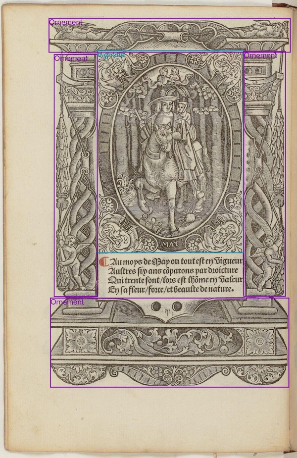
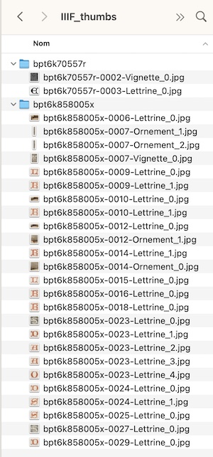
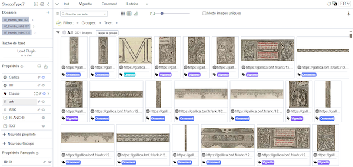

# Roboflow
Roboflow integration with Gallica content (and [Panoptic](https://panopticorg.github.io/))

## General context
- Extraction of typographical material from the early prints of the Réserve collections (BnF)
- Roboflow [project](https://app.roboflow.com/snooptypo)
- [Methodology](https://docs.google.com/presentation/d/1TdVedZGo4_sOiXMk-Do7hSQA7STYTNOU_ZxO1fHRrXw/edit?slide=id.g12b1dcf850d_0_49#slide=id.g12b1dcf850d_0_49)

<i>(A French version of this tutorial is available)</i>

## 1. Extracting images from Gallica

<b>Workflow</b>:
1. Obtaining images of documents (Gallica IIIF API, extraction script).
2. Ingesting a subset of these documents into Roboflow for annotation.
3. Processing the rest of the corpus.

`extract_iiif.py` must be feed with a file of ARK IDs and a image ratio for extraction (> 0.0 and <= 1.0):

```
python extract_iiif.py arks.txt 0.5
```
Notes:
- Remember to restart the script to cover the case where the API failed the first time.
- Images are stored in a `IIIF_images folder`, in subfolders named by ARK IDs.

## 2. Training a model with Roboflow
See this [tutorial](https://docs.google.com/presentation/d/1-a0tdgQRa2K5ESwN5IhTn8VnGtDaxeseK37TgvtaiHY/edit?slide=id.g12b1dcf850d_0_49#slide=id.g12b1dcf850d_0_49)
and [methodology](https://docs.google.com/presentation/d/1TdVedZGo4_sOiXMk-Do7hSQA7STYTNOU_ZxO1fHRrXw/edit?slide=id.g12b1dcf850d_0_49#slide=id.g12b1dcf850d_0_49)


## 3. Obtain annotations made in Roboflow

This step allows to get access to the annotated data but also to reuse it under the same conditions as the data produced later by inference.

<b>Workflow</b>:
1. Export the annotated dataset from Roboflow in COCO format.
In [Roboflow](https://app.roboflow.com/snooptypo/snooptypo/models): 
- Go to the Versions tab. Click on the Download Dataset button
- Format: COCO, option: Download zip to computer
  
Notes:
- The dataset must have been generated <i>without</i> augmentation in Roboflow, otherwise the same images will appear multiple times. 
- The dataset includes JSON COCO annotations and the annotated images once uploaded to Roboflow.

2. Prepare the processing
- Unzip the .zip file into the processing folder. The annotated images are divided into three subfolders: test, train, and valid.
- In this particular project, we have to restore the link to Gallica ARKs based on document titles. This data is contained in the `arks_database.csv` file. Not necessary if the images are named after the ARK document.

3. Process the dataset
- The `export_boxes.py` script processes JSON COCO annotations in order to extract frames from annotated content (ornate letters, decorations, etc.), superimpose them on images, and generate thumbnails of the content. It also generates CSV data for further processing, as well as CSV data that will be needed to import useful metadata into [Panoptic](https://panopticorg.github.io/) (including the URL links to Gallica).

There are two types of thumbnails produced:
- extracted from Roboflow images,
- generated via the Gallica IIIF API (at the best available resolution): optional, must be requested when calling with -i

The script must be run on each test, train, and valid subfolder. Example with the test folder:
```
python extract_boxes.py test 0.7 -i
```

After processing, the data produced is stored in the `output` folder:
- images of pages with annotated content boxes superimposed
- IIIF thumbnails of content (`IIIF_thumbs` folder), organised by ARK
- extracted thumbnails (thumbs folder), organised by ARK and content type (classes from the classification scheme)
- CSV data:
  - `processed_data.csv`: one line per annotation ARK,View,Image_filename,Category_name,Gallica,IIIF,Annotation_filename
 - `import_pano.csv`: one line per annotated image, for later import into Panoptic
path;Gallica[url];IIIF[url];Class[tag];ARK[text]
 - one JSON file per annotated image in Roboflow Supervision format, in the SV folder



## 4. Use the model on other documents 

The model trained in Roboflow can be used to automatically annotate new documents (inference mode).

<b>Workflow</b>:
1. Install the Roboflow Python environment
- In a Terminal, create a Python environment:
```
python -m venv roboflow
source roboflow/bin/activate
pip install inference
```

2. Identify the model descriptors

- Identify the Roboflow API key for the project on the Roboflow website, in the Settings tab, then ‘API Keys’
- The key (‘Private API Key’) must be copied and pasted into this command line:

```
export ROBOFLOW_API_KEY="your key"
```

- Identify the name of the model that was trained in Roboflow, in the Project Versions tab, then by selecting the relevant version. The name of the model is given in the ‘Model URL’ field, here `snooptypo/2`.

3. Launch processing

To launch processing of an image folder from a Gallica document, using a model named `snooptypo/2`, enter this command in Terminal:
 
```
python roboflow_inference.py btv1b86000632 snooptypo/2 -i
```

The folder must be named after the ARK identifier. Recursive processing of a folder of folders is possible:
```
python roboflow_inference.py IIIF_images snooptypo/2 -i
```

The results are stored in a `JSON` folder (one data file per image, named ark/ark-vue.json).  

The elements detected in the images are described in the JSON data: position in the image, type, detection confidence. 

```
[
    {
        "x_min": 220.0,
        "y_min": 306.0,
        "x_max": 375.0,
        "y_max": 460.0,
        "class_id": 0,
        "confidence": 0.90966796875,
        "tracker_id": "",
        "class_name": "Lettrine",
        "file": "btv1b86000632/btv1b86000632-0001.jpg,
        "model": "snooptypo/2"
    }
]
```
Notes:
- With the -s option, the detected elements are annotated on the image and the image is saved (in the source folder).
- With the -i option, IIIF thumbnails of the detected elements are exported via the Gallica IIIF API (in the `IIIF_thumbs` folder).
- With the -d option, the detected elements are annotated on the image and the image is displayed.



## 5. Integration with Panoptic app 

The import of iconographic corpora in [Panoptic](https://panopticorg.github.io/) is done in two steps:
1. Importing the thumbnails extracted in the previous steps
2. Importing associated metadata (optional)

For a subfolder processed in the previous step, you must therefore:
- Zip the thumbnails 
- Copy this zip file to the a server accessible to your Panoptic instance and unzip it
- Import this folder into a Panoptic project
- Once the import is complete, import the metadata (`import_pano.csv` file) into Panoptic

At this stage, Panoptic should display the image thumbnails and their metadata:
- URL to Gallica (actionable by Ctrl-click)
- image type (ornament, letter, illustration)




## 6. Convert infered annotations to the IIIF standard

The JSON annotations produced by the previous steps can be converted to the IIIF standard so that they can be used by IIIF-compatible tools. The `roboflow2iiif.py` script performs this conversion for a folder of JSON files (Supervision format). This folder must be named after the ARK of the Gallica document. The second parameter of the script is the size ratio used when obtaining images via the IIIF API.

```
python roboflow2iiif.py JSON/bpt6k70557r 0.5
```

The script produces an IIIF annotation file (IIIF Presentation 2.0 version) in the `IIIF_annotations` folder. This file can then be opened in an IIIF-compatible viewer.


